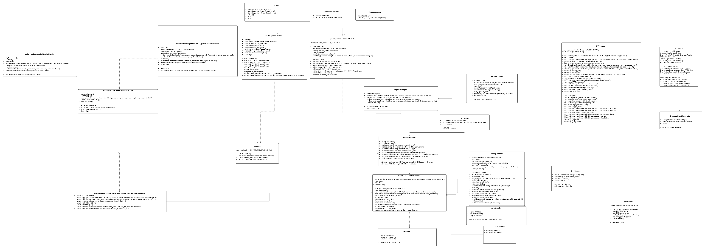
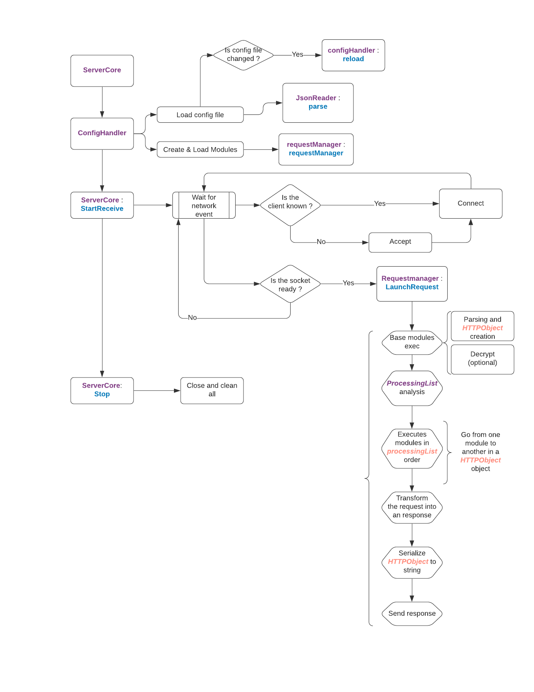

# Zia

## Project

The goal of the Zia project is to create an HTTP server. This server will be able to serve typical HTTP documents and page requests, as well as CGI execution and more. The server is written in C++, with support for interoperable modules.

This project was a 3rd year EPITECH project and it was made by :
- Adrian HOARAU (adrian.hoarau@epitech.eu)
- Arthur BERTAUD (arthur.bertaud@epitech.eu)
- Matthias VIRASSAMY (matthias.virassamy@epitech.eu)
- Benjamin COULON (benjamin.coulon@epitech.eu)
- Yoann LE PECH (yoann.lepech@epitech.eu)

## API

Here is a class diagram of our API (it is much more complete than the required one)



## Workflow



## Config File

The Zia HTTP Server needs a config file to work properly. This file will have to be in the **JSON** format and the path to it will have to be given when launching the server.

```json
{
    "zia": {
        "modules": [
            "snakeModule"
        ],
        "SSL Certificate Path": "./config/SSL/mycert.pem",
        "CGI Dir Path": "./config/PHP/"
    }
}
```

Here is an example of a basic **JSON** config file with the *snakeModule* as well as the ''SSL Certificate Path'' and the ''CGI Dir Path''

## Build and Launch

In this section we will see how to build the project using *Conan* and *CMake* on **Linux** and **Windows 10**

### Linux Build

#### Prerequisities

To launch the project on a Linux OS you **must** have Conan installed on your machine as well as the conan settings configured for you machine.
Of course the Packages mentionned in the conanfile.txt have to be installed.

#### How to build Linux

1. Go to the project root and create a `build` directory : `mkdir build`
2. Then go in that folder : `cd build`
3. Launch the Conan build command : `conan install .. --build=missing`
4. Then launch the CMake building command : `cmake .. -G "Unix Makefiles"`
5. Finally build the project : `cmake --build .`
6. After that you will find the `zia` executable

### Windows Build

#### Prerequisities

To launch the project on a Windows 10 OS you **must** have the following tools installed : (_check links in the doc section of the README_)

- Visual Studio 16 2019 (_version used: **16.8.1**)_
- Conan Package Manager  (_version used: **1.31.2**)_

Conan will install for you the following packages _(refer to conafile.txt in root)_

1. Boost _(**1.69**)_
2. OpenSSL _(**1.1.1a**)_
3. ZLib _(**1.2.11**)_
4. BZip2 _(**1.0.6**)_
5. nlohmann_json _(**3.2.0**)_

#### How to build Windows

1. First of all you might want to install all packages required by launching the following commad : `conan install .. -s compiler="Visual Studio" -s compiler.version=16 -s arch=x86_64 -s build_type=Release --build=missing`
2. After that create a build folder and get into it : `mkdir build && cd build`
3. Then launch the CMake build : `cmake .. -G "Visual Studio 16 2019"`
4. Finally, build the solution file with that command : `cmake --build . --config Release`
5. After that you will find the `zia.exe` in the`bin` folder and the modules in the lib folder.

### Launch

#### Linux Launch

You will need to specify the path to the config file (**it has to be a json file**) and the path to the module folder

`./build/bin/zia ./config/config.json build/lib/`

#### Windows Launch

Same as the Linux Launch

`build\bin\zia.exe .\config\config.json .\build\lib`

## SSL

The zia HTTP Server contains a SSL Module that be can used to ensure a secure data transfer between the server and the client.

To do so, the server will need a certificate (**.pem**) and in addition the client will also need to have the certificate.

If you need to create a certificate to create to test your own, refer to [this link](https://gist.github.com/cecilemuller/9492b848eb8fe46d462abeb26656c4f8) (you will need to have openSSL installed on your machine).

### How to use your certificate on the Zia Server

To do so you need to add the path to your file in the config file as the `SSL Certificate Path` (check the [Config File](#Config-File) section)

You should put your certificate file in the `config/SSL` folder.

⚠️ The Zia Server will uses the same file path to check both the **key file** and the **chain file**. So make sure they both are in the **.pem** file. ⚠️

### How to test the SSLModule

In order to test the SSLModule and the HTTPS secured connection you will need to have a client that has the certificate. Two methods are available.

#### Use any web browser

You can use almost any web browser to test out our *SSLModule*. The only thing you will have to do is to add the certificate to your browser.

Here is a way to do it on **Google Chrome Browser** (on Windows 10):

1. Go to the page [chrome://settings/security](chrome://settings/security)
2. Go to the Advanced and `Manage certificates`
3. A pop up will appear and click on `Import`
4. Choose the certificate file (**.crt**) and place it into the **Trusted Root Certification Authorities** Certificate Store to ensure a fully fonctionnal browser experience.
5. After that go to the following url [https://localhost:8084/test](https://localhost:8084/test)

#### Use the *LaunchHTTPSRequest* script

You can use **LaunchHTTPSRequest* bash script to test the HTTPS secure connection. To do so execute it that way: `./scripts/launchHTTPSRequest`

⚠️ **You will need the .pem file** ⚠️

Here is the usage:

```

Usage: ./launchHTTPSRequest <type> <port> <pathtocertificate>
    <type>: Type of client to use:
        "curl": Curl client with one time request (but many SSL info)
        "openssl": OpenSSL client with possibility to send several request to server
    <port>: The port of the server
<pathtocertificate>: The path to the key and certificate file
```

Here is a **"openssl"** example so that you can type a full HTTPS Request

````bash

./launchHTTPSRequest.sh openssl 8084 ./mycert.pem << eof
GET /snake HTTP/1.1
Host: localhost:8084
eof
````

## Add a Custom Module

The Zia server is a customizable server where you can add modules. In order to do so, you will have to create a Class that will inherit from IModule.

First thing you will need to do is to create a folder for your module in the `./modules` directory and add a corresponding CMakeList.txt in that folder.

⚠️ You will also need to add the subdirectory into the `./modules` CMakeList.txt. `add_subdirectory(myModule)` ⚠️

Here are the methods that you will have to reimplement:

````cpp

class IModule {
    public:
        /** @brief Dtor of IModule (virtual cause Interface) */
        virtual ~IModule() = default;
        /** @brief This function will be called each time a request is received
            *  @param req HTTPObject class filled with request's information
        */
        virtual void processRequest(HTTP::HTTPObject& req) = 0;
        /** @brief This function will be called for each module after its creation
            *  @param path Needed path for the right operation of the module (optional)
        */
        virtual void init(const std::string& path) = 0;
        /** @brief This function will return the moduleType of the current instance of IModule
            *  @return moduleType Type of module
        */
        virtual moduleType getModuleType() const = 0;
};
````

Your Module class will also need to have an `export "C"` method that will be used to create the *.so* (Linux) or the *.lib* (Windows).

Here is what you have to put in your module *.cpp* file:

````cpp
#if defined (_WIN32)
  
    extern "C"  __declspec(dllexport)
    void *entryPoint()
    {
        return (new std::shared_ptr<myModule>(new myModule));
    }

#else

    extern "C" std::shared_ptr<IModule> entryPoint()
    {
        return (std::make_shared<myModule>());
    }

#endif
````

Finally if you want to add your module to the server, add the name of your module to the config file like so:

````json
{
    "zia": {
        "modules": [
            "myModule"
        ],
        "SSL Certificate Path": "./config/SSL/mycert.pem",
        "CGI Dir Path": "./config/PHP/"
    }
}
````

## Documentation

- [Conan Windows Install](https://docs.conan.io/en/latest/installation.html)
- [Windows Visual Studio C++ install](https://docs.microsoft.com/fr-fr/cpp/build/vscpp-step-0-installation?view=msvc-160)
- [Create a localhost SSL certificate](https://gist.github.com/cecilemuller/9492b848eb8fe46d462abeb26656c4f8)
